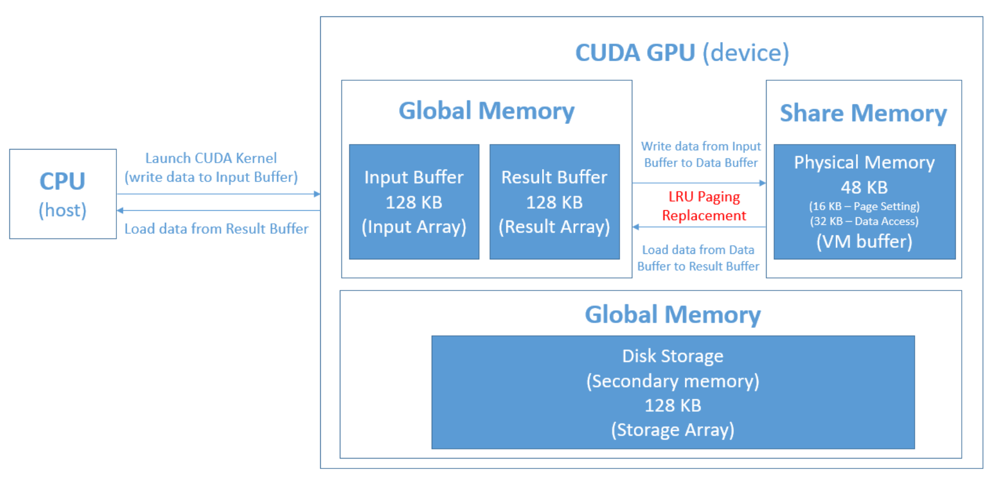

# GPU-Based Virtual Memory Simulation

## Overview

This project simulates a virtual memory mechanism on a GPU, utilizing CUDA for memory management. It's designed to emulate the behavior of virtual memory systems, providing insights into memory management techniques in a GPU environment. You can find the full project description [here](./report.pdf).


**Whole Picture**


## Key Features

- **Virtual Memory Simulation on GPU**: Uses GPU memory to simulate virtual memory, leveraging CUDA.
- **LRU Page Replacement Algorithm**: Implements Least Recently Used (LRU) strategy for efficient page replacement.
- **Multi-threaded Execution Support**: Capable of running in multiple threads, showcasing concurrent memory management. (In bonus section)

**Flow Chat**
<!-- 更改图片大小 -->


## Implementation Details


- **CUDA Implementation**: Developed using CUDA for parallel processing and memory handling on the GPU.
- **Memory Segments**: Handles memory segments such as shared memory (as physical memory) and global memory (as secondary storage).
- **Page Fault Handling**: Implements page fault handling with data swapping between shared and global memory.

## Specification of the GPU Virtual Memory we designed:
- Secondary memory (global memory) 128KB (131072 bytes)
- Physical memory (share memory) 48KB (32768 bytes) 
    - 32KB for data access
    - 16KB for page table setting Memory replacement policy for page fault:
- If shared memory space is available, place data to the available page, otherwise, replace the LRU set. Pick the least indexed set to be the victim page in case of tie.
- We have to map virtual address (VA) to physical address (PA).
- The valid bit of each page table block is initialized as false before first data access in shared memory.
- Page size 32 bytes 
- Page table entries 1024 (32KB / 32 bytes)

## Setup and Usage

- **Environment Setup**: You can find the full environment setup instructions [here](./report.pdf).
- **Running the Simulator**:
```
// For single thread
cd source 
sbatch slurm.sh

// For multi-thread
cd bonus
sbatch slurm.sh
```